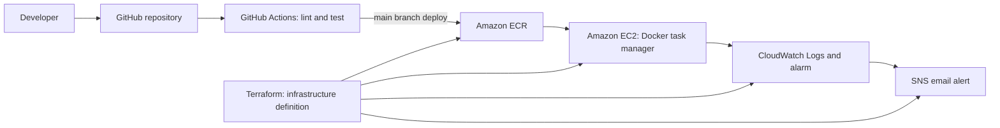

# DevOps Task API

A beginner-friendly task manager with a browser interface and a Python REST API, packaged in Docker and deployable to AWS EC2 from GitHub Actions. Add, edit, complete, filter, and delete tasks from the page. The in-memory task store is intentionally simple; tasks reset when the process restarts. This portfolio project also demonstrates how a code change moves through tests, a container registry, an EC2 host, and basic monitoring.

[](https://github.com/OWNER/REPOSITORY/actions/workflows/ci-cd.yml)

> Replace `OWNER/REPOSITORY` in the badge URLs after creating your GitHub repository.

## Architecture



## Tech stack

| Area | Tools |
| --- | --- |
| Web app and API | HTML/CSS/JavaScript, Python 3.11, FastAPI, Pydantic |
| Quality | pytest, HTTPX, Ruff |
| API exploration | Postman Collection v2.1 |
| Containers | Docker, Docker Compose |
| CI/CD | GitHub Actions |
| AWS | ECR, EC2, IAM, CloudWatch, SNS |
| Infrastructure | Terraform |

## Features

- Browser-based task manager at `/` with an add form, inline editing, complete toggle, and All/To do/Done filters.
- `GET /health` returns `{"status":"ok"}`; the JSON API supports create, list, fetch, update, and delete at `/tasks`.
- Pydantic validates task titles (1–100 characters); `done` defaults to `false`.
- Isolated endpoint tests, a non-root container, container health check, and deployment smoke test.
- SSH ingress is restricted by your supplied CIDR; HTTP is public for the demo.

## Host a no-login web version

For a frontend hosted on Vercel with durable database storage, see [web/README.md](web/README.md). That version uses Supabase Postgres with a background guest identity, so there is no login screen and each browser has a private task list. It is a separate static frontend; the FastAPI, Docker, and AWS portfolio path above remains available.

## Prerequisites

- Python 3.11, Git, and Make (or run the equivalent commands below).
- Docker Engine/Desktop and Docker Compose v2 for container steps.
- Postman for collection-based manual API checks.
- For AWS deployment: AWS account, AWS CLI, Terraform 1.6+, an SSH client, and a GitHub repository.

## Local development

Create and activate a virtual environment:

```bash
python3.11 -m venv .venv
source .venv/bin/activate          # Windows PowerShell: .venv\Scripts\Activate.ps1
python -m pip install -r requirements.txt
```

Run quality checks and the API:

```bash
make lint
make test
make run
curl http://localhost:8000/health
```

Open `http://localhost:8000` for the task manager. The interactive API documentation is at `http://localhost:8000/docs`. The API uses memory for storage, so tasks reset when the app restarts; it is for demos and learning rather than durable production data.

### Docker

```bash
make docker-build
docker compose up -d --build
curl http://localhost:8000/health
docker compose down
```

The image listens on port 8000, runs as `appuser`, and exposes a Docker health check. `make docker-run` keeps Compose attached to the terminal; use Ctrl+C to stop it.

### Postman

Import `postman/task-api.postman_collection.json`. The collection variable `baseUrl` defaults to `http://localhost:8000`. Run requests in order: Create task saves `taskId`, which Get, Update, and Delete reuse. Each request checks its response status and relevant body fields.

## AWS deployment guide

This repository describes infrastructure and deploys a container, but intentionally does not create AWS resources. Review the monthly cost and regional pricing before proceeding. An EC2 instance, public IPv4 address, ECR storage, logs, and notifications may incur charges even during demos.

### 1. Prepare AWS access safely

1. Create or use an AWS account and enable MFA on the account's administrative identity.
2. Set an AWS Budget alert before provisioning; the AWS Free plan/free-tier eligibility varies by account and date. A budget alert is a notification, not a spending cap.
3. For Terraform, use an IAM identity with permissions limited to the resources this configuration creates (EC2/key pairs/security groups, IAM role and instance profile, ECR, CloudWatch, SNS, and SSM parameter reads). Do not use root credentials. Review the plan and permissions with your administrator.
4. Configure AWS CLI credentials locally with an IAM identity. Never commit credentials or private keys.
5. Create an SSH key pair and protect the private key:

```bash
ssh-keygen -t ed25519 -f ~/.ssh/task-api-demo
```

6. Find your current public IP and provide it as a single-address CIDR such as `203.0.113.10/32`. Avoid opening SSH to everyone.

### 2. Validate and provision

From the repository root, prepare local Terraform inputs. The example file contains placeholders only; copy it to the ignored `terraform.tfvars` file and replace all example values.

```bash
cp terraform/terraform.tfvars.example terraform/terraform.tfvars
# Set public_key to the contents of ~/.ssh/task-api-demo.pub and update my_ip/alert_email.
terraform -chdir=terraform fmt -recursive
terraform -chdir=terraform init -backend=false
terraform -chdir=terraform validate
terraform -chdir=terraform plan
```

Inspect the plan and estimated cost. When you are ready, you may run `terraform -chdir=terraform apply` yourself. This project has not run apply. Confirm the SNS subscription from the email AWS sends. Save the outputs:

```bash
terraform -chdir=terraform output public_ip
terraform -chdir=terraform output ecr_repository_url
```

### 3. Configure GitHub secrets and deploy

In **Repository → Settings → Secrets and variables → Actions**, add:

| Secret | Value |
| --- | --- |
| `AWS_ACCESS_KEY_ID` | Access key for a dedicated deployment IAM identity |
| `AWS_SECRET_ACCESS_KEY` | Matching secret access key |
| `EC2_HOST` | Terraform `public_ip` output |
| `EC2_SSH_KEY` | Contents of the matching private SSH key (keep it private) |

Limit the deployment IAM identity to ECR authentication and push permissions for this repository. EC2 pulls images using its instance profile; do not put AWS keys on the server. Push to `main` after CI passes to build and push the image, replace the running container, and retry the HTTP health check.

On first use, cloud-init installs Docker and may take a few minutes after EC2 becomes reachable. Check the instance system log if SSH deployment runs before setup finishes. The `awslogs` Docker log driver sends container logs to the `task-api` CloudWatch group.

For a stronger setup, replace long-lived GitHub access keys with GitHub OIDC federation. Restrict the IAM trust policy to this repository and branch/environment, and grant only ECR permissions needed to push. If your repository is public, consider SSH host-key pinning rather than automatically accepting the first host key.

### 4. Tear down after demos

When finished, destroy the resources and remove the GitHub secrets if no longer needed:

```bash
terraform -chdir=terraform destroy
```

The ECR repository is configured with `force_delete = true`, so destroy can remove its images. Check billing and CloudWatch logs after cleanup.

## CI/CD and branching

Pull requests run Ruff and pytest. A push to `main` runs the same checks and, after success, builds and deploys the Docker image. The separate Terraform workflow checks formatting and validates Terraform when Terraform files change. Review workflow permissions and pin third-party actions to full commit SHAs for a hardened production pipeline.

Use short-lived feature branches from `dev`, open pull requests into `dev`, and promote reviewed changes from `dev` into `main`. A push to `main` is the deployment trigger, so protect the branch and require successful CI checks.

## Helper scripts and Linux practice

The scripts in `scripts/` are intended for a Linux EC2 shell:

```bash
./scripts/ec2-setup-check.sh
./scripts/logs.sh
./scripts/cleanup.sh
```

They check the Docker service and container health, follow container logs, and prune unused Docker images. Image pruning removes local unused images; use it only when you understand which images the host still needs.

## Screenshots

Add screenshots after running the project. Suggested captures:

- `[TODO: Add Postman collection run screenshot here]`
- `[TODO: Add GitHub Actions successful run screenshot here]`
- `[TODO: Add AWS architecture or EC2 console screenshot here; hide account identifiers and public IPs]`

## What I learned

- How to design and test a small REST API with explicit HTTP status codes.
- How to package a service in a non-root Docker image and check its health.
- How a CI pipeline can gate container publishing and deployment.
- How Terraform connects AWS identity, network, compute, registry, and monitoring resources.
- Why protecting SSH, credentials, budget, and cleanup steps matters in a cloud demo.

## Future improvements

- GitHub OIDC authentication instead of long-lived access keys.
- RDS or DynamoDB persistence for tasks.
- EKS/Kubernetes manifests and a Jenkinsfile for alternate deployment practice.
- HTTPS behind a load balancer with a managed certificate.
- Add API authentication, rate limiting, and production-grade observability.
